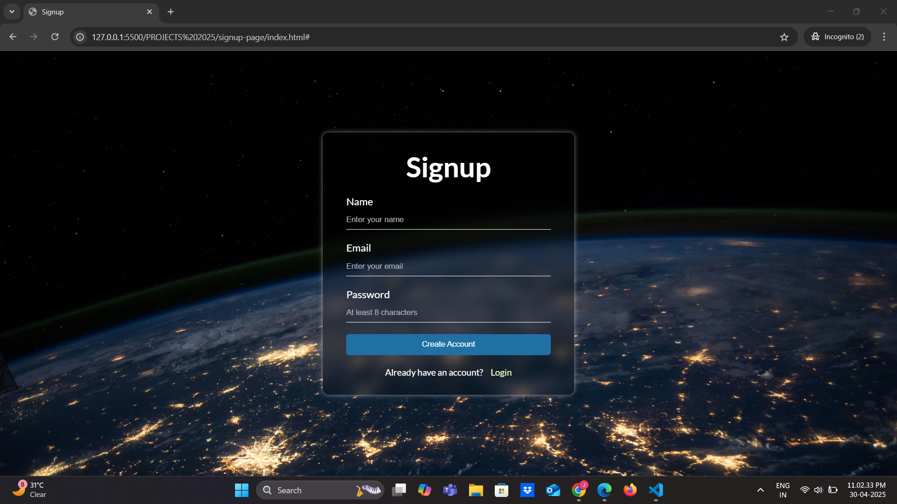

# Modern Responsive Signup Form ✨

A clean, responsive signup form with sleek glassmorphism design, built with pure HTML and CSS.

## Live Demo  
🔗 [View Project](https://signup-page-robinson.netlify.app/) 

## 🔥 Key Features

- **Glassmorphism UI** with backdrop blur effect
- **Fully responsive** across all devices (mobile, tablet, desktop)
- **Modern CSS techniques**:
  - CSS variables for easy theming
  - Viewport-relative units (vw, vh)
  - Advanced media queries
- **UX-optimized** form with:
  - Input validation
  - Hover effects
  - Accessibility best practices
- **Performance-focused**:
  - No frameworks/bloat
  - Optimized background image

## 🛠️ Tech Stack

- **HTML5** semantic markup
- **CSS3** (Flexbox, Media Queries, Variables)
- **Google Fonts** (Lato)
- **Vanilla JS** (planned for form validation)

## 🚀 Why This Stands Out

This project demonstrates my ability to:
- Create **visually appealing UI** with modern effects
- Implement **responsive design** principles
- Write **clean, maintainable code**
- Solve real-world **frontend challenges**

## 📱 Responsive Breakpoints

| Device          | Width Applied  |
|-----------------|----------------|
| Mobile          | < 640px        |
| Tablet          | 640px - 1024px |
| Desktop         | > 1024px       |

---

⭐ **Star this repo if you find it useful!**  
🔗 *Connect with me on [LinkedIn](https://www.linkedin.com/in/robinsonlal/)*
